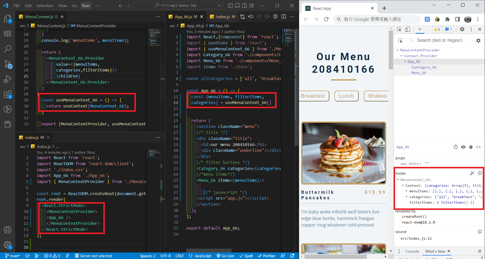
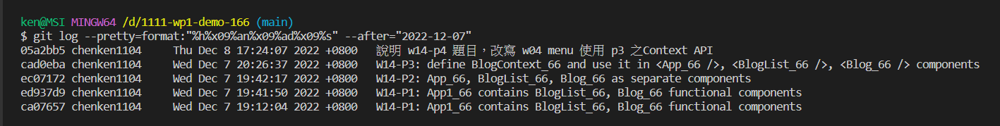

### W14-P1: App1_66 contains BlogList_66, Blog_66 functional components

### W14-P2: App_66, BlogList_66, Blog_66 as separate components

### W14-P3: define BlogContext_66 and use it in <App_66 />, <BlogList_66 />, <Blog_66 /> components

### 說明 w14-p4 題目，改寫 w04 menu 使用 p3 之Context API

### logs

