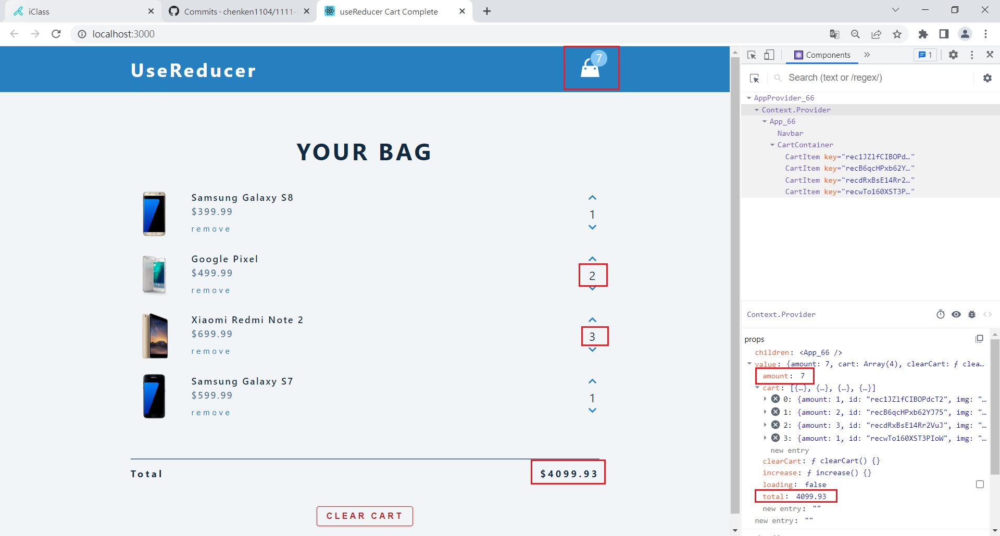

### W15-P1: Setup AppProvider_66 for App_66 and get state data

### W15-P2: replace data in CartContainer using global context

### W15-P3: put clear cart function in global context

### W15-P4: provide get total function in global context

 

